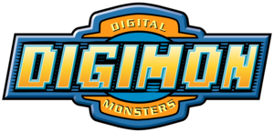

&emsp;&emsp;&emsp;&emsp;&emsp;&emsp;&emsp;&emsp;&emsp;&emsp;&emsp;&emsp;&emsp;&emsp;&emsp;&emsp;&emsp;&emsp;&emsp; 
# Digidex

Projeto tecnico para vaga de front-end GF financeiro.

## Descrição

O projeto consiste em uma página web que consome uma API e exibe o conteúdo da resposta em uma lista de cards, conforme o design abaixo. É possível filtrar os cards ultilizando botões ou um campo de busca. Cada card possui um botão que exibe uma modal com os detalhes do seu conteúdo.

### API:
```bash
https://digimon-api.vercel.app/
```
### Design:
```bash
https://www.figma.com/file/E5QRysbITnnjTnofg0RCts/Projeto-digimon?type=design&node-id=0-1&mode=design&t=cbe73LEQlHcnbGQd-0
```
## Modo de execução
Navegue até a raíz do diretório e abra o arquivo "index.html".
